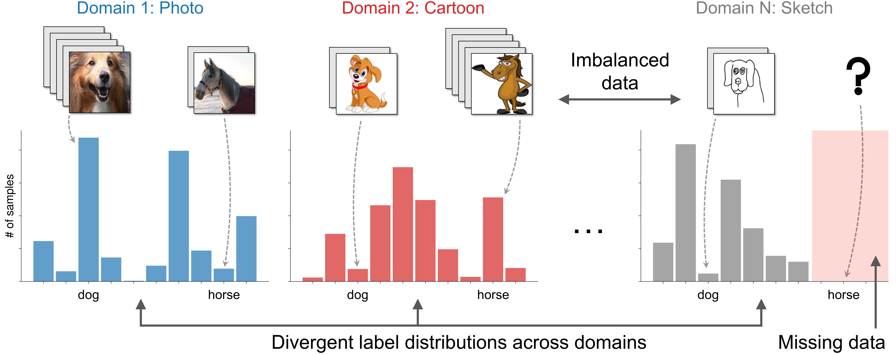

# On Multi-Domain Long-Tailed Recognition, Generalization and Beyond

This repository contains the implementation code for paper: [On Multi-Domain Long-Tailed Recognition, Generalization and Beyond](https://arxiv.org/abs/2203.09513).

<p align="center">
     <br>
<b>Multi-Domain Long-Tailed Recognition (MDLT)</b> aims to learn from imbalanced data from multiple distinct domains,<br>tackle <i>label imbalance</i>, <i>domain shift</i>, and <i>divergent label distributions across domains</i>, and generalize to all domain-class pairs.
</p>


## MDLT: From Single- to Multi-Domain Imbalanced Learning
Existing studies on data imbalance focus on __single-domain__ settings, i.e., samples are from the same data distribution. However, natural data can originate from __distinct domains__, where a minority class in one domain could have abundant instances from other domains. We systematically investigate _Multi-Domain Long-Tailed Recognition (MDLT)_, which learns from multi-domain imbalanced data, addresses _label imbalance_, _domain shift_, and _divergent label distributions across domains_, and generalizes to all domain-class pairs.

We develop the _domain-class transferability graph_, and show that such transferability governs the success of learning in MDLT. We then propose _BoDA_, a theoretically grounded learning strategy that tracks the upper bound of transferability statistics, and ensures balanced alignment and calibration across imbalanced domain-class distributions.

We curate MDLT benchmark datasets based on widely-used multi-domain datasets, and benchmark ~20 algorithms that span different learning strategies for MDLT.


## Beyond MDLT: Domain Generalization under Data Imbalance
Further, as a byproduct, we demonstrate that _BoDA_ strengthens Domain Generalization (DG) algorithms, and establishes new state-of-the-art on DG benchmarks.
Note that all current standard DG benchmarks naturally exhibit heavy class imbalance within domains and label distributions shift across domains, confirming that data imbalance is an intrinsic problem in DG, but has yet been overlooked by past works.

The results shed light on how label imbalance can affect out-of-distribution generalization, and highlight the importance of integrating label imbalance into practical DG algorithm design.


## Updates
- __[03/17/2022]__ [ArXiv version](https://arxiv.org/abs/2203.09513) posted. The code is currently under cleaning. Please stay tuned for updates.


## Citation
```bib
@article{yang2022multi,
  title={On Multi-Domain Long-Tailed Recognition, Generalization and Beyond},
  author={Yang, Yuzhe and Wang, Hao and Katabi, Dina},
  journal={arXiv preprint arXiv:2203.09513},
  year={2022}
}
```
